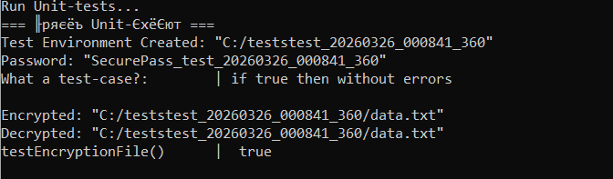
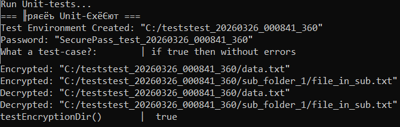
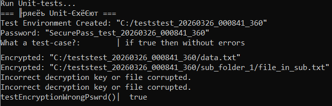
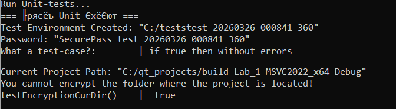
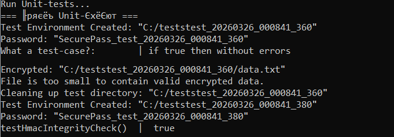
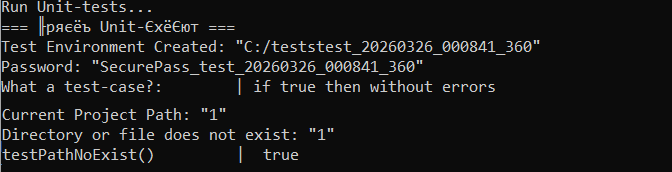
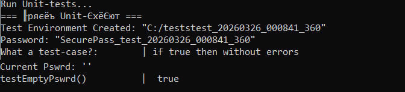
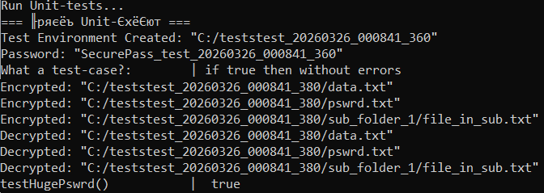

# Лабораторная работа №1: Защита данных пользовательских папок и файлов

**Описание проекта:**
Консольное приложение для шифрования/дешифрования содержимого пользовательских папок и всех вложенных файлов. Реализовано рекурсивное шифрование с использованием алгоритма AES-256 в режиме CBC. Для класса шифрования используется паттерн Singleton.

**Функциональные возможности**
- Шифрование всех файлов в директории с использованием AES-256 (CBC) по введённому паролю
- Дешифрование ранее зашифрованных файлов

**Используемые технологии:**
- Алгоритм шифрования: AES-256 (CBC режим)
- Криптографическая библиотека: OpenSSL (libcrypto)
- Работа с Qt (QDir, QFile, QFileInfo)
- Механизм подписи данных HMAC

**Механизм целостности данных (HMAC)**
Для защиты от повреждения или изменения зашифрованных данных при шифровании используется HMAC:

- Вычисляется хеш HMAC-SHA256 на основе ключа и соли
- Контрольная сумма сохраняется в конце файла
- В начало файла добавляется заголовок магическая подпись \x00ENCRYPT

**Проверка целостности при дешифровании**
При попытке дешифрования программы проверяется:

- Наличие магической подписи \x00ENCRYPT в начале файла.
- Совпадение вычисленного HMAC с сохраненным значением.
- Если пароль неверный, или файл подменён приложение отклоняет операцию

**Результат работы:**
- После шифрования содержимое всех файлов по указаному пути зашифровано
- После успешного дешифрования файлы содержат исходные данные

**Особенности:**
- Длина пароля не ограничена
- Программа содержит защиту от случайного шифрования директории с проектом
- Пароль не хранится: Пароль используется только для динамической генерации ключа в момент работы программы.

**Технологии и зависимости**
- Qt Framework: Используется для работы с файловой системой (QDir, QFile, QFileInfo) и вводом/выводом.
- OpenSSL (libcrypto): Криптографическая библиотека, обеспечивающая алгоритмы AES-256-CBC, SHA-256, HMAC.
- C++17: Поддерживается современный стандарт языка для работы с памятью и контейнерами.

**Формат тестирования:**
1. Для тестирования класса Encryptor используется класс TestEncryptor, он запускается в модуле run_tests.cpp
2. Всего предусмотренно 8 тестов:
   - Два положительных теста, для проверки цикла шифрование-дешифрование, базовая работоспособность
   - Шесть негативных тестов, для проверки граничных случаев
3. Создаётся тестовая среда по пути C:/teststests_yyyyMMdd_hhmmss_zzz,
 название каждый раз уникальное, поэтому для упрощения обозначим тестовую среду как tests  
4. Все функции тест-кейсов возвращают true если тест пройден правильно и false если неправильно, 
 поэтому **ожидаемый результат в тест-кейсах не является интерпритацией самих тестов**, а указывает на результат
 вызовов функций шифрования-дешифрования входе выполнения теста.

**Описание тест-кейсов:**
1. Положительные тесты:  
    1) *testEncryptionFile*     
    Суть: Создание файла, его шифрование и последующая расшифровка.
    Файл находится в тестовой среде по пути:  
        - tests/data.txt
    Ожидаемый результат: Файл успешно зашифрован-расшифрован и содержимое идентично оригиналу.  
    encryptData() -> true и decryptData() -> true        
      

    2) *testEncryptionDir*  
    Создаём структуру в тестовой среде:
        - tests/data.txt
        - tests/sub_folder_1
        - tests/sub_folder_1/file_in_sub.txt  
    Суть: После создания среды, передаём путь к ней шифруем-дешифруем.  
    Ожидаемый результат: Все файлы в основной папке и вложенной подпапке успешно зашифрованы и расшифрованы.
    encryptData() -> true и decryptData() -> true         
      

2. Негативные тесты:
    1) *testEncryptionWrongPswrd*  
    Воссоздаём структуру из Положительного теста 2).
    Суть: Попытка зашифровать и расшифровать пользовательские данные разными паролями.
    Ожидаемый результат: decryptData() -> false, так как ключ не совпадает.
      

    2) *testEncryptionCurDir*  
    Суть: Попытка зашифровать текущую рабочую директорию проекта.
    Ожидаемый результат: Операция не должна пройти encryptData() -> false и соответсвующее сообщение с ошибкой.
      

    3) *testHmacIntegrityCheck*    
    Суть: Намеренная порча зашифрованного файла (запись мусора вместо данных) и попытка расшифровки.
    Ожидаемый результат: Контрольная сумма HMAC должна выявить подмену, и decryptData() -> false.
      
    
    4) *testPathNoExist*  
    Суть: Попытка зашифровать по несуществующему пути (строка "1").
    Ожидаемый результат: encryptData() -> false и сообщение об ошибке.
      
    
    5) *testEmptyPswrd*  
    Суть: Попытка зашифровать/расшифровать данные с использованием пустой строки в качестве пароля.
    Ожидаемый результат: Операция должна пройти без ошибок encryptData() -> true.
      
    
    6) *testHugePswrd*   
    Суть: Использование пароля огромного размера (~65 тыс. символов), сгенерированного циклом, чтобы проверить стабильность работы шифровальщика.
    Ожидаемый результат: Тест проверяет, что система не падает при обработке гигантских входных данных для ключа; успешное выполнение encryptData() -> true означает устойчивость к таким нагрузкам.
      